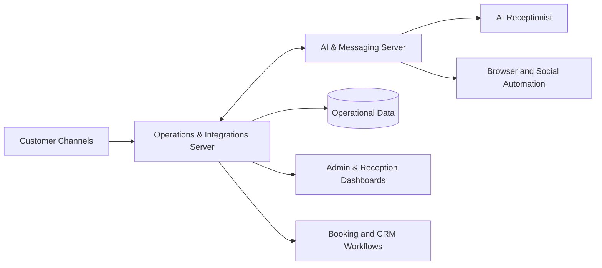
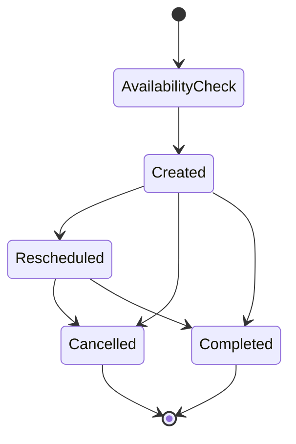

# AI-Powered Salon Operations Platform

> Production case study — architecture and scope only. The private source code, customer data, credentials, and infrastructure details are intentionally not published.

## Overview

A four-month, two-server automation platform designed and implemented end to end by a sole developer. It connects live appointment operations, customer messaging, AI-assisted reception, CRM workflows, dashboards, and production infrastructure.

## Architecture

### Operations & integrations server

- Live booking availability engine
- Cron-based synchronization jobs
- Real-time appointment creation, cancellation, and rescheduling
- Single-service and combo-service booking flows
- WhatsApp workflows and customer communication
- CRM logic, customer tags, waitlists, and no-show tracking
- Webhooks and conversion events
- Reception and administration dashboards

### AI & messaging server

- AI receptionist and conversation workflows
- AI administration API
- Instagram reader/writer automation
- Playwright browser automation
- Local availability services
- Human handoff and operational control

## Production engineering

- Python and FastAPI services
- AI/LLM API integrations
- Docker and containerized workloads
- PostgreSQL and SQLite data layers
- REST APIs and webhook integrations
- Playwright with Chromium
- Linux, systemd, and Nginx
- Monitoring, health checks, scheduled jobs, and backups
- Separation of operational and AI workloads across two servers

## Appointment lifecycle

The workflow writes real appointment changes in real time and supports both individual services and combined multi-service bookings.

## Responsibilities

I independently owned:

- System architecture and technical decisions
- Backend and API development
- AI and messaging integrations
- Browser automation
- Data modeling and workflow logic
- Linux deployment and reverse-proxy configuration
- Monitoring, reliability, and backups
- Ongoing production operations

## Technology stack

`Python` · `FastAPI` · `AI/LLM APIs` · `Docker` · `Playwright` · `REST` · `Webhooks` · `PostgreSQL` · `SQLite` · `Linux` · `systemd` · `Nginx` · `Git`

## Privacy note

This repository documents engineering scope and architecture without exposing proprietary source code, customer information, secrets, IP addresses, or third-party credentials.
